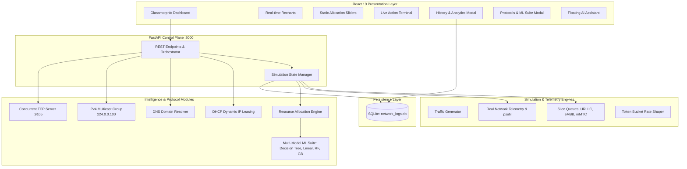

# 🌐 NetSlice: AI-Assisted 5G/6G Network Slicing & Resource Allocation

[](docker-compose.yml)
[](https://fastapi.tiangolo.com)
[](https://react.dev)
[](https://vitejs.dev)
[](https://scikit-learn.org)
[](https://sqlite.org)
[](LICENSE)

An end-to-end, production-ready research platform demonstrating next-generation **5G/6G Network Slicing**, proactive QoS resource allocation, real physical network telemetry, and foundational networking protocols (DHCP, DNS, Multicast, concurrent TCP/UDP sockets).

---

## 📌 Project Status Overview

| Capability | Module | Status | Details |
|---|---|:---:|---|
| **Synthetic Simulation Engine** | `simulation/` | ✅ **100% Complete** | Simulates URLLC, eMBB, and mMTC packet generation and queues |
| **Real-Time Physical Telemetry** | `real_network.py` | ✅ **100% Complete** | Ingests live NIC traffic via `psutil`, measures true RTT latency |
| **Token-Bucket Rate Shaper** | `real_network.py` | ✅ **100% Complete** | Hardware-independent socket shaping matching dynamic slice caps |
| **AI Resource Allocation Engine** | `simulation/allocation.py` | ✅ **100% Complete** | Static, Rule-Based, and Proactive AI bandwidth redistribution |
| **Multi-Model ML Suite** | `simulation/ml_engine.py` | ✅ **100% Complete** | Benchmarks Decision Trees, Linear Reg, Random Forest & Gradient Boosting |
| **SQLite Persistence & Analytics** | `database.py` | ✅ **100% Complete** | 1-sec telemetry logging, QoS violation tracking, audit trail |
| **Context-Aware AI Assistant** | `ai_assistant.py` | ✅ **100% Complete** | Integrated chatbot powered by Gemini LLM with offline fallback |
| **DHCP IPv4 Dynamic Leasing** | `simulation/dhcp.py` | ✅ **100% Complete** | Virtual MAC binding, 192.168.1.100–250 pool, TTL expiration |
| **DNS Slice Domain Resolution** | `simulation/dns.py` | ✅ **100% Complete** | Resolves `urllc.slice.5g` etc. to IP:Port endpoints with custom records |
| **IPv4 Multicast Group Control** | `simulation/multicast.py` | ✅ **100% Complete** | IGMP signaling on `224.0.0.100:9999` with subscriber management |
| **Concurrent TCP & UDP Sockets** | `real_network.py` | ✅ **100% Complete** | Multi-threaded TCP stream server (`:9105`) + UDP sockets (`:9101-9103`) |
| **Modern Dashboard & Theming** | `frontend/` | ✅ **100% Complete** | Glassmorphism UI with White, Warm, and Midnight Slate themes |
| **Docker & Docker Compose** | Root | ✅ **100% Complete** | Multi-stage Nginx frontend + Python backend with persistent volume |

---

## ⚡ Quickstart with Docker (Recommended)

Docker Compose encapsulates all Python dependencies, Node packages, and system libraries into isolated containers, eliminating any version or OS clashes.

### 1. Clone Repository
```bash
git clone <your-repository-url>
cd network_pro
```

### 2. (Optional) Configure Environment
```bash
# On Linux / macOS:
cp .env.example .env

# On Windows PowerShell:
Copy-Item .env.example .env
```
*(Optional)* Add your [Gemini API Key](https://aistudio.google.com/app/apikey) in `.env` for conversational AI capabilities. The chatbot works offline with rule-based heuristics if no key is provided.

### 3. Run Everything with 1 Command
```bash
docker compose up --build
```

### 4. Access the Platform
- **React Dashboard:** [http://localhost:5173](http://localhost:5173) (or [http://localhost](http://localhost))
- **FastAPI Documentation:** [http://localhost:8000/docs](http://localhost:8000/docs)
- **FastAPI Alternative Docs (ReDoc):** [http://localhost:8000/redoc](http://localhost:8000/redoc)

To stop the containers:
```bash
docker compose down
```

---

## 💻 Running Locally without Docker

If you prefer running natively on your host machine:

### System Requirements
- **Python 3.10+** (Tested on Python 3.11, 3.12, 3.13)
- **Node.js 18+** & **npm 9+**

### 1. Start the Backend Server
```bash
cd backend

# Create and activate virtual environment
# Windows PowerShell:
python -m venv venv
.\venv\Scripts\Activate.ps1

# macOS / Linux:
# python3 -m venv venv
# source venv/bin/activate

# Install dependencies
pip install -r requirements.txt

# Start FastAPI orchestrator
uvicorn main:app --reload --port 8000
```

### 2. Start the Frontend Dashboard
In a second terminal:
```bash
cd frontend

# Install dependencies
npm install

# Start Vite dev server
npm run dev
```

Navigate to **`http://localhost:5173`** in your browser.

---

## 🏗️ Architecture & Core Components



---

## 🎮 Interactive Features Guide

### 1. Dual Operational Modes
- **Synthetic Simulation Mode:** Generates realistic mathematical traffic models representing VoIP, gaming, 4K streaming, and IoT telemetry.
- **Real-Time Physical Mode:** Connects to your active network card (`Wi-Fi`, `Ethernet`), pulls physical throughput counters, and shapes real UDP packets via a Token Bucket limiter.

### 2. Allocation Strategies
- **Static Allocation:** Allows manual adjustment of bandwidth quotas (e.g. 30M / 50M / 20M) using the interactive sliders.
- **Rule-Based Allocation:** Dynamically reallocates capacity to URLLC if its utilization crosses 85% or packet loss occurs.
- **AI-Assisted Allocation:** Employs trained machine learning regressors to forecast next-interval demand and preemptively reallocate bandwidth before congestion strikes.

### 3. Multi-Model ML Benchmarking Suite
Click the **"Protocols & ML"** button in the top navigation bar and navigate to the **ML Model Suite** tab:
- Choose between **Decision Tree**, **Linear Regression**, **Random Forest**, and **Gradient Boosting**.
- Click **"Train & Compare All"** to train all four models simultaneously on historical SQLite traffic logs.
- Inspect the side-by-side comparison table showing $R^2$ fit scores and Mean Squared Error (MSE) across all slices.

### 4. Advanced Networking Protocols
- **DHCP IP Leasing Tab:** Simulate virtual client node requests. Provide a MAC address (e.g., `AA:BB:CC:11:22:33`), pick a target slice, and receive a leased IPv4 address from the `192.168.1.0/24` subnet with TTL expiration tracking.
- **DNS Domain Resolution Tab:** Query custom slice hostnames (`urllc.slice.5g`, `embb.slice.5g`, `mmtc.slice.5g`) and receive resolved IP addresses and socket ports. Add custom DNS records on the fly.
- **IPv4 Multicast Tab:** Transmit control-plane signals to multicast group `224.0.0.100:9999` and review delivery receipts across subscriber nodes.

### 5. Historical SQLite Analytics
Click the **"History"** button in the navbar:
- View recorded 1-second snapshots with throughput, latency, and packet drops.
- Review Quality of Service (QoS) violation audits and slice utilization peaks.
- Trigger model retraining directly from historical data.

### 6. AI Network Assistant
Click the chat icon in the bottom-right corner:
- Ask free-form technical questions or click prompt chips (e.g., *"How is my Wi-Fi performing?"*, *"Are any slices dropping packets?"*).
- The assistant analyzes real-time telemetry and database logs to give tailored answers.

---

## 📡 REST API Reference

### System & Telemetry Endpoints
| Method | Endpoint | Description |
|---|---|---|
| `GET` | `/api/status` | Current simulation status, active mode, and network telemetry |
| `POST` | `/api/start` | Start the simulation or real network engine |
| `POST` | `/api/stop` | Stop all active threads and generators |
| `GET` | `/api/network/interfaces` | List detected physical/virtual network adapters |
| `POST` | `/api/network/mode` | Switch operational mode (`simulation` or `real_network`) |
| `GET` | `/api/logs` | Fetch rolling action terminal logs |

### Traffic & Allocation Endpoints
| Method | Endpoint | Description |
|---|---|---|
| `POST` | `/api/slices/configure_static` | Update custom static bandwidth distribution (Mbps) |
| `POST` | `/api/simulate_spike` | Inject an instant traffic multiplier on a specific slice |
| `POST` | `/api/simulate_scenario` | Trigger traffic presets (`peak_hours`, `gaming_tournament`, etc.) |

### Machine Learning & Benchmarking
| Method | Endpoint | Description |
|---|---|---|
| `POST` | `/api/train` | Train and evaluate all 4 ML algorithms from SQLite logs |
| `POST` | `/api/ml/model` | Set the active model algorithm (`decision_tree`, `linear_regression`, `random_forest`, `gradient_boosting`) |
| `GET` | `/api/ml/status` | Current active model, training timestamp, and $R^2$/MSE comparison |

### Networking Protocols
| Method | Endpoint | Description |
|---|---|---|
| `GET` | `/api/dhcp/leases` | Retrieve all active DHCP IPv4 leases and expiration TTLs |
| `POST` | `/api/dhcp/request` | Lease a dynamic IPv4 address for a virtual MAC address |
| `GET` | `/api/dns/records` | List all registered domain records and lookup history |
| `POST` | `/api/dns/resolve` | Resolve a domain hostname to IP and socket port |
| `POST` | `/api/dns/add` | Register a new custom DNS A/SRV record |
| `GET` | `/api/multicast/status` | View multicast group status, subscribers, and message log |
| `POST` | `/api/multicast/broadcast` | Broadcast an IGMP signal to group `224.0.0.100:9999` |

### Database & Analytics
| Method | Endpoint | Description |
|---|---|---|
| `GET` | `/api/history` | Query historical snapshot logs with pagination and slice filtering |
| `GET` | `/api/analytics/summary` | Overall QoS violation count, packet drop rate, and peak stats |
| `POST` | `/api/chat` | Send a query to the AI Network Assistant |

---

## 📁 Repository Structure

```
network_pro/
├── docker-compose.yml              # 1-command Docker orchestration
├── .env.example                    # Environment variable template
├── .gitignore                      # Git exclusion rules
├── README.md                       # Comprehensive project documentation
├── reference.md                    # Project architectural specifications
│
├── backend/
│   ├── Dockerfile                  # Python 3.11-slim production container
│   ├── .dockerignore               # Backend container exclusions
│   ├── requirements.txt            # Python dependencies (pinned)
│   ├── main.py                     # FastAPI server, CORS & route orchestrator
│   ├── database.py                 # SQLAlchemy SQLite engine & logging models
│   ├── real_network.py             # Live telemetry, TCP/UDP sockets, token bucket
│   ├── ai_assistant.py             # Context-aware Gemini AI chatbot
│   └── simulation/
│       ├── slices.py               # Slice data structures & packet queues
│       ├── traffic_generator.py    # Multi-threaded synthetic traffic generator
│       ├── monitor.py              # Telemetry polling & database logging
│       ├── allocation.py           # Static, Rule-based & AI allocation engine
│       ├── ml_engine.py            # Multi-model ML training & benchmarking suite
│       ├── dhcp.py                 # Dynamic DHCP IPv4 allocation simulation
│       ├── dns.py                  # Domain name resolution service
│       └── multicast.py            # IPv4 multicast group communication
│
└── frontend/
    ├── Dockerfile                  # Multi-stage React + Nginx container
    ├── .dockerignore               # Frontend container exclusions
    ├── nginx.conf                  # Nginx SPA config with /api reverse proxy
    ├── package.json                # React 19 dependencies & scripts
    ├── vite.config.js              # Vite bundler configuration
    └── src/
        ├── config.js               # Centralized dynamic API URL configuration
        ├── Dashboard.jsx           # Main application layout & global state
        ├── index.css               # Vanilla CSS design system & color themes
        └── components/
            ├── Navbar.jsx          # Header with live mode, controls & theme switcher
            ├── SliceCards.jsx      # Real-time slice telemetry cards
            ├── MetricsCharts.jsx   # Moving time-series charts (Recharts)
            ├── StaticSliders.jsx   # Interactive bandwidth allocation sliders
            ├── TrafficTweaker.jsx  # Stress-test scenarios & traffic spikes
            ├── ActionTerminal.jsx  # Live scrolling CLI terminal logs
            ├── AnalyticsModal.jsx  # SQLite database history & QoS report
            ├── NetworkProtocolsModal.jsx # DHCP, DNS, Multicast & ML Suite GUI
            └── ChatbotWidget.jsx   # Integrated floating AI assistant
```

---

## 🛠️ Configuration & Environment Variables

| Variable | Default | Description |
|---|---|---|
| `PORT` | `8000` | Port for the FastAPI backend server |
| `DATABASE_PATH` | `network_logs.db` | File path for SQLite database (in Docker: `/app/data/network_logs.db`) |
| `GEMINI_API_KEY` | *(Empty)* | Optional Google Gemini API key for live AI assistant responses |
| `VITE_API_URL` | `http://localhost:8000` | Backend API base URL for frontend (leave blank in Docker for Nginx proxy) |

---

## 📄 License
This project is open-source and available under the [MIT License](LICENSE).
